# The Cat Shack
## MS4 Code institute project 

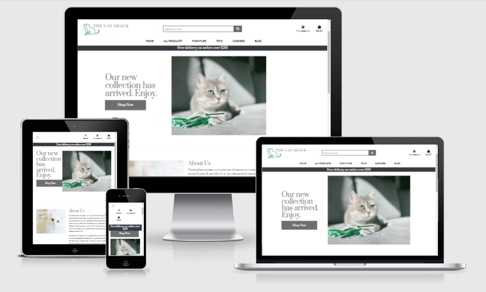


The Cat Shack has been created for my MS4 project with the code institute. The Cat Shack is an e-commerce luxury pet store which utlizies stripe for payments. The website will build upon existing skills within HTML, CSS and Javascript, and utilize new skills learned within Python, Jinja and Django. 


Please [click here](https://the-cat-shack.herokuapp.com/) to view the website.


### Index

- [Ux](#ux)
- [Features](#features)
- [Resources](#resources)
- [Testing](#testing)
- [Problems and solutions](#problems-and-solutions)
- [Deployment](#deployment)
- [Credits](#credits)
- [Acknowledgements](#acknowledgements)


## UX
 
### Aims

**Site owner's goal**

To build an elegant online store which reflects "The Cat Shack" brand where luxury pet products can be purchased.


**External user’s goal** 

Purchase luxury pet goods with ease. 


 
#### User Stories

As a Store Owner I want to be able to:

> - *Add Products*
> - *Edit Product Information*
> - *Delete Products*
> - *Add Blog Posts*


As a Site User I want to be able to:


> -  *Use the site with ease on mobile, tablet and pc devices.*
> -  *Learn more about the company via social media*
> - *Be able to comment on blog posts*
> - *Register for an account*
> - *Log in and out of the e-commerce store with ease*

As a Shopper I want to be able to: 
> -  *View different products via categories*
> -  *Sort products by price, rating and category*
> -  *Search for a product easily*
> - *Get answers to questions regarding shipping and faulty items*
> - *Easily select the quantity of a product*
> - *Adjust items within the shopping bag*
> - *Easily enter profile information*
> - *View an order confirmation once an order has been placed*
> - *Receive email notification once an order has been placed*

As a logged in Site User I want to be able to:
> - *View my profile and have the ability to save profile information from the checkout*
> - *View my order history*

## Scope

Due to time contraints I opted to make an MVP where CRUD functionality exists for admin users.


### Skeleton

#### Database

 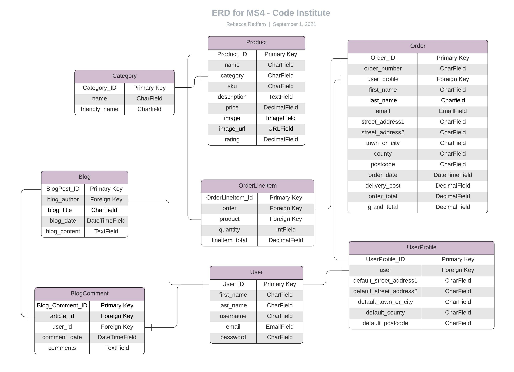

#### Wireframes

Wireframes have been created using a mobile first approach.
Please [click here](https://github.com/rebeccadev/the_cat_shack/blob/main/readme_documentation/pdf/userstoryloggedinsiteuser.pdf) to view the PDF showing full wireframes for the site. 


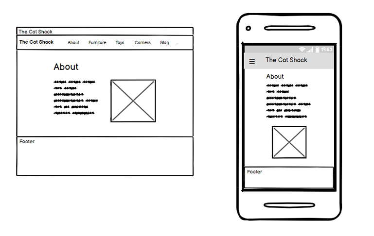


### Surface
I have taken on inspiration from gaming websites such as the Oculus website. I feel the simple colour scheme
of black, white and grey makes for a modern and clean look for the website. 


**Colours**

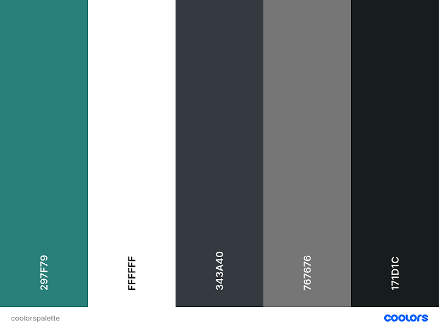

I wanted to make a modern design, utilising a monochrome colour palette with a splash of green natural tones. White space has also been used to provide a sense of calm.

I have used (#ffffff) for my main text to make the typography contrasting and clear to the user against the white background. 
and have used the text-muted class for my text within the footer section to stand out against the dark background. 

**Typography**


**Heading text**

The font Prata  has been used for headings - this font works well as it is bold,and elegant, providing an upmarket feel to the website. 

**Body text**

Lora has been used for the body text, this sans serif font is clearly legible to the user, especially on mobile devices. It also contrasts nicely
against the heading font.


**Imagery**

Unsplash, Pexels and dreamstime have been used for all the photography within the website. I chose modern images that would fit with
the colour palette and provide a modern and luxury feel to the website. 


---
## Features

### Current features

- **Homepage**
   * Homepage featuring a call to action button to entice new users to check out the products available for the store.
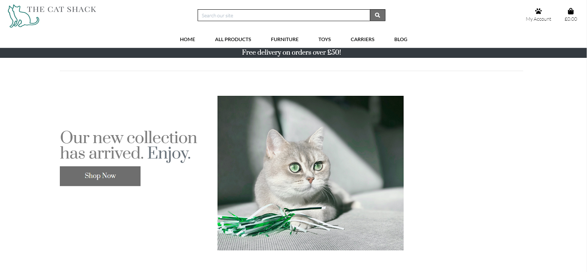
- **Products Page**
  * Products page which details all products that can be sorted via price, caterogry and rating.
  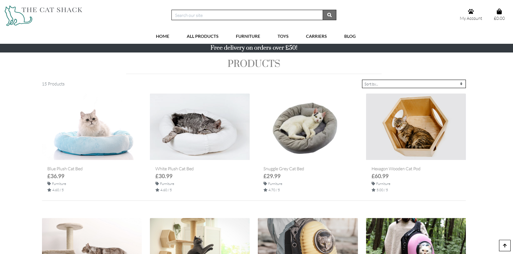
- **Products detail page**
   * Product details page where users can find out more information on a product and add it to their shopping bag.
   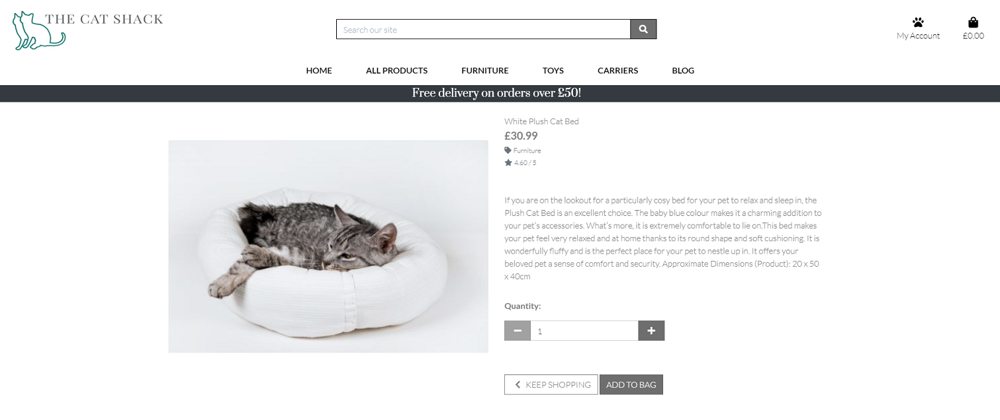
- **Registration page/Log In Page** 
   * Where website users can sign up for an account and log in to the store
     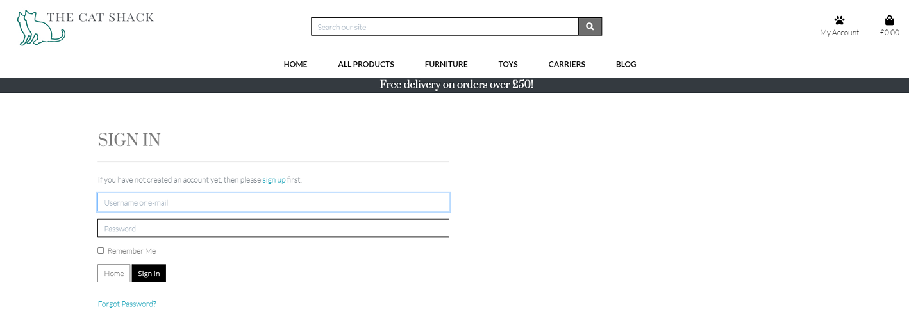
- **Profile page**
   * A user profile, website users can store their profile information here and it will also show their order history
   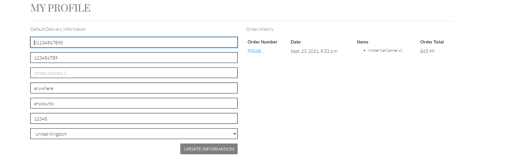
- **Search feature** 
   * A search bar where users can search for different products across the website
   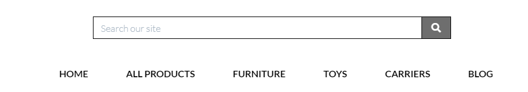
- **Shopping bag**
  * Users can adjust items in their shopping bag from this page.
  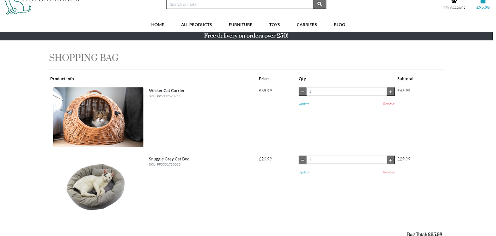
- **Blog and comments Page**
   *The site owner can post blogs via the admin interface and users can comment on these. Which is great for customer interaction.
 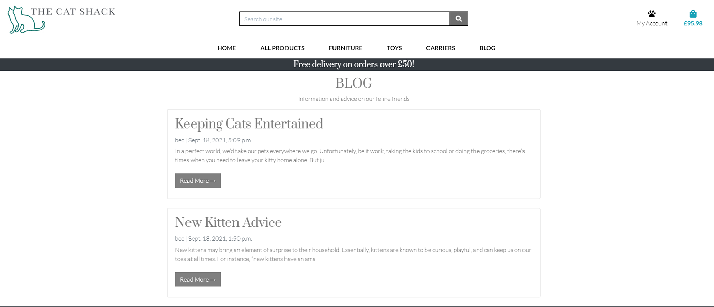
- **Footer**
   * The footer features links to social media platforms, which is great for marketing and encouraging brand loyalty. It also features
a news letter where customers can receive news from the store. Quick links have been added for a good UX experience. 
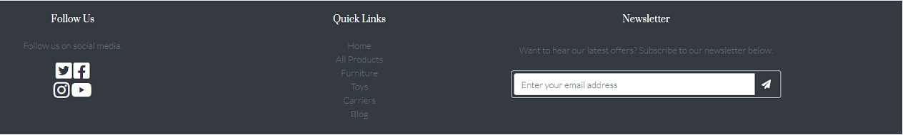

### Features to be added

These are features that lie out of the current scope, but could be added added at a later date.

- **Enable functionality for newsletter in the footer**
- **Add a contact form where users are able to make queries**
- **Link items from the website to the blog to encourage further transactions**
- **Add a gallery where users can upload images of their pets with products purchased from the website** 

## Technologies 

The following technologies have been used in the project.

**Languages**

- HTML 

- CSS

- Jquery

- Python

## Libraries and Frameworks

* [Bootstrap](https://getbootstrap.com/) - a free and open-source CSS framework directed at responsive, mobile-first front-end web development.
- [Django](https://www.djangoproject.com/) - a high-level Python web framework that encourages rapid development and clean, pragmatic design.
- [Django Cripsy Forms](https://django-crispy-forms.readthedocs.io/en/latest/) - django-crispy-forms will let you control the rendering behavior of your Django forms in a very elegant and DRY way.
- [Jinja](https://jinja.palletsprojects.com/en/3.0.x/) - a web template engine for the Python programming language
- [Stripe](https://stripe.com/ie) - offers payment processing software and application programming interfaces for e-commerce websites and mobile applications.

**Integrations**
- [Font Awesome](https://fontawesome.com/) - used for icons within the footer bar. 

- [Google fonts](https://fonts.google.com/) - A library of 1005 free licensed font families. 


**IDE, Version control, Repository storage**

* [Git](https://git-scm.com/) - Distributed Version Control tool to store * versions of files and track changes.

* [GitPod](https://gitpod.io/) - Workspace IDE.

* [GitHub](https://github.com/) - Hosting service used to manage my Git repositories.


## Resources

The following resources have been used within the project.


* [Adobe Photoshop](https://www.adobe.com/uk/products/photoshop.html) for editing image sizes and editing the hero image.

* [w3schools.com](https://www.w3schools.com/) - resource to improve general knowledge of HTML and CSS and Javascript

* [Balsamiq](https://balsamiq.com/) - used for the creation of wireframes during UI design stage. 

* [Stack Overflow](https://stackoverflow.com/) - general resource used for technical queries.

* [Chrome DevTools](https://developers.google.com/web/tools/chrome-devtools) - used to debug HTML and CSS and to view responsiveness on different screen sizes.

* [Lucid Chart](https://www.lucidchart.com/) - Database Relationship Diagrams Design Tool

## Testing

All testing for the website can be found [here](https://github.com/rebeccadev/the_cat_shack/blob/main/testing.md)

 ## Problems and solutions

### Design 

## Deployment

### Deploying locally

In order to clone the project the following steps need to be taken. 

1. Click the green code button and copy the following command into the terminal "git clone https://github.com/rebeccadev/the_cat_shack.git"
2. Set up a .env file and add the following code. 
```
import os  
os.environ["DEVELOPMENT"] = "True"    
os.environ["SECRET_KEY"] = "<Your Secret Key>"
os.environ["STRIPE_PUBLIC_KEY"] = "<Your Stripe Public Key>"    
os.environ["STRIPE_SECRET_KEY"] = "<Your Stripe Secret Key>"    
os.environ["STRIPE_WH_SECRET"] = "<Your Stripe WH Secret Key>"    
```
3. Use the command "pip3 install -r requirements.txt" to install the required packages for the website.
4. Create the database by first making migrations "python3 manage.py makemigrations"
5. Migrate with the command "python3 manage.py migrate"
6. 

### Deploying to heroku

In order to deploy the website onto Heroku the following steps need to be taken

1. Create a Heroku account and log in.
2. In the Heroku dashboard select create a new app.
3. Choose a unique name for the app and make sure to select the location nearest to you.
4. Go to the resources tab and look for Heroku Postgres in the search bar.
 In the heroku dashboard go the settings Tab and set the following config vars 

- AWS_ACCESS_KEY_ID	= Your AWS Access Key
- AWS_SECRET_ACCESS_KEY	= Your AWS Secret Access Key
- DATABASE_URL =	Your Postgres Database URL
- EMAIL_HOST_PASS =	Your Email Password (generated by Gmail)
- EMAIL_HOST_USER =	Your Email Address
- SECRET_KEY =	Your Secret Key
- STRIPE_PUBLIC_KEY =	Your Stripe Public Key
- STRIPE_SECRET_KEY =	Your Stripe Secret Key
- STRIPE_WH_SECRET =	Your Stripe WH Key
- USE_AWS	True

5. In order to use Postgres the following items need to be installed - 
   In the terminal type pip3 install dj_database_url and 
   pip3 install psycopg2-binary. 
6. Freeze the requirements with pip3 freeze > requirements.txt to ensure heroku installs the apps requirements.
7. Go to settings.py file and import dj_database_url
8. In the database setting comment out the default database configuration and replace it with the following.
```
DATABASES = {
        'default': dj_database_url.parse(os.environ.get('DATABASE_URL'))
    }
```
9. Go to the apps settings tab and to the config variables copy the DATABASE_URL.
10. Use the command python3 manage.pu migrate to migrate the database models to the Postgres database.
11. Next use python3 manage.py loaddata categories to load the data
12. Then use python3 manage.py loaddata products to load product data. *It's important to loaddata in this order since products are dependant on categories*
13. A super user then needs to be created with python3 manage.py createsuperuser
14. Before commiting remove the heroku database config and uncomment the original so the URL doesn't end up in version control.
15. Add the following code to settings.py
```
if 'DATABASE_URL' in os.environ:
    DATABASES = {
        'default': dj_database_url.parse(os.environ.get('DATABASE_URL'))
    }
else:
    DATABASES = {
        'default': {
            'ENGINE': 'django.db.backends.sqlite3',
            'NAME': os.path.join(BASE_DIR, 'db.sqlite3'),
        }
    }
```
16. Install gunicorn with the command pip3 install gunicorn.
17. Freeze the requirements with pip3 freeze > requirements.txt
18. Create a Procfile and enter the following web: gunicorn the_cat_shack.wsgi:application
19. Disable collectstatic temporarily by using the command heroku config:set DISABLE_COLLECTSTATIC=1 --app to ensure heroku won't collect static files on deployment.
20. In settings.py add 'the-cat-shack.herokuapp.com', 'localhost' to allowed hosts.
21. Use git add. and git commit -m "" to add changes and then use git push to deploy to Heroku.
22. Generate a django secret key and add it to config variables in Heroku.
23. Go back to settings.py and change the secret key setting to 
```
SECRET_KEY = os.environ.get('SECRET_KEY', '')
```

### Setting up automatic deploys to Github
1. Go to Heroku and select the deploy tab.
2. In the depployment method deceltion select GitHub.
3. Use the search box to find your repository and click connect.
4. Go to the automatic deploys section and click the 'Enable Automatic Deploys' button.

### Creating an S3 Bucket
1. Sign up for an AWS account.
2. Click on services and find "S3". Click the orange "create bucket"
3. Create a Bucket Name - it would be best practice to use the same name as the Heroku App
4. On the region dropdown select the region closest to you.
5. Uncheck Block all public access and click the tickbox to acknowledge the bucket will be public.

### Settings for S3 Bucket
1. Click on the properties tab and select use this bucket to host website.
2. For the index and error document fill in default values and click save.
3. Click on the permissions tab and click Cors configuration.
4. Place the following code
```
	[
  {
      "AllowedHeaders": [
          "Authorization"
      ],
      "AllowedMethods": [
          "GET"
      ],
      "AllowedOrigins": [
          "*"
      ],
      "ExposeHeaders": []
  }
]
```
5. Click the Bucket Policy tab and select policy generator.
6. Select S3 Bucket Policy in Type of Policy menu.
7. In the Principal field use * to allow all principals.
8. In the actions dropdown select GetObject.
9. Copy the ARN and paste it into the ARN box.
10. Click add statement.
11. Click generate policy.
12. Copy this policy into the Bucket Policy editor.
13. Add /* onto the end of the resource key to allow full access to the bucket.
14. Click save.
15. Go to the access control list tab and select the list objects permission for everyone.

### Setting up access management. 

1. Go to the services menu and click IAM.
2. Click group and set group name.
3. Click next step and "create group"
4. Click on Policies and "create policy"
5. Go to the json tab and select import managed policy.
6. Search S3 and import AmazonS3FullAccess policy.
7. Edit the resource by adding the earlier Bucket ARN
```
	"Resource": [
			                "arn:aws:s3:::the-cat-shack",
			                "arn:aws:s3:::the-cat-shack/*"
            ]
```
8. Click review policy.
9. Complete the name and description fields.
10. Click create policy.
11. Click on the groups tab - select relevant group and click attach policy.
12. Select the policy that was created and attatch it.
13. Click on the Users tab in the sidebar.
14. Click the add user button. 
15. Create a user the-cat-shack-staticfiles-user
16. Under the Access type click programmatic access and select next.
17. Add user to group and click create user. 
18. Download the generated .csv file which will contain the access key and secret access key.

### Linking S3 and django.

1. Install boto3 with pip3 install boto3
2. Install django storages with pip3 install django-storages
3. Freeze the requirements with pip3 freeze > requirements.txt
4. From the generated .csv file add the following config vars in the Heroku Settings tab
- AWS_ACCESS_KEY_ID
- AWS_SECRET_ACCESS_KEY
5. In settings.py add storages to installed apps. 
6. Add the following code 
```
if 'USE_AWS' in os.environ:
    # Cache control
    AWS_S3_OBJECT_PARAMETERS = {
        'Expires': 'Thu, 31 Dec 2099 20:00:00 GMT',
        'CacheControl': 'max-age=94608000',
    }

    # Bucket Config
    AWS_STORAGE_BUCKET_NAME = 'the-cat-shack'
    AWS_S3_REGION_NAME = 'eu-west-2'
    AWS_ACCESS_KEY_ID = os.environ.get('AWS_ACCESS_KEY_ID')
    AWS_SECRET_ACCESS_KEY = os.environ.get('AWS_SECRET_ACCESS_KEY')
    AWS_S3_CUSTOM_DOMAIN = f'{AWS_STORAGE_BUCKET_NAME}.s3.amazonaws.com'

    # Static and media files
    STATICFILES_STORAGE = 'custom_storages.StaticStorage'
    STATICFILES_LOCATION = 'static'
    DEFAULT_FILE_STORAGE = 'custom_storages.MediaStorage'
    MEDIAFILES_LOCATION = 'media'

    # Override static and media URLS in production
    STATIC_URL = f'https://{AWS_S3_CUSTOM_DOMAIN}/{STATICFILES_LOCATION}/'
    MEDIA_URL = f'https://{AWS_S3_CUSTOM_DOMAIN}/{MEDIAFILES_LOCATION}/'
```
7. In the Heroku config vars delete the 
 - DISABLE_COLLECTSTATIC variable and deploy the app.

## Credits


### Copy
- Copy for the product images was sourced from [Pets At Home](https://www.petsathome.com/) and [Amazon](https://www.amazon.com/)

- Copy for the New Kitten blog post was sourced from [Trupanian](https://trupanion.com/blogs/kitten-care-101)

- Copy for the Keeping your cat entertained blog post was sourced from [Pet Secure](https://www.petsecure.com.au/pet-care/10-ways-keep-cat-entertained-youre-house/)

- The copy on the homepage was written by myself.

### Code

- The project built upon the Boutique Ado project from The Code Institute.

- [Django Central](https://djangocentral.com/building-a-blog-application-with-django/) - the following tutorial was used to build the blog application.

- [The Net Ninja](https://www.youtube.com/watch?v=LAIVhl2CG8E) Django Tutorial #17 - Uploading Media by The Net Ninja was used to add images to the blog.

### Imagery

- [Unsplash](https://unsplash.com/) was used for the images on the homepage.

- [Pexels](https://www.pexels.com/) was used for blog images. 

- [dreamstime](https://www.dreamstime.com/) was used for the product images.

## Acknowledgements

- Channel lead Gaff for advice and support with planning. 

- Tutor support for help with technical queries, in particular John and Scott.

- My mentor Aaron Sinnot for their advice and help throughout the project. 