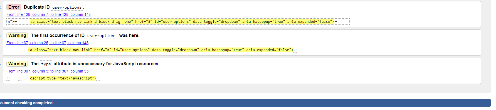
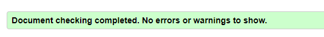
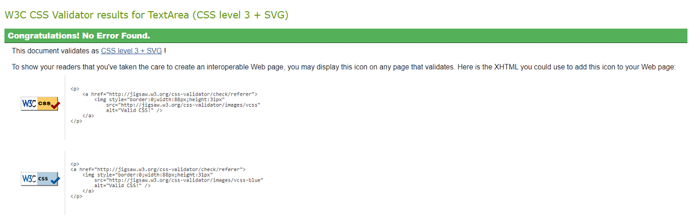
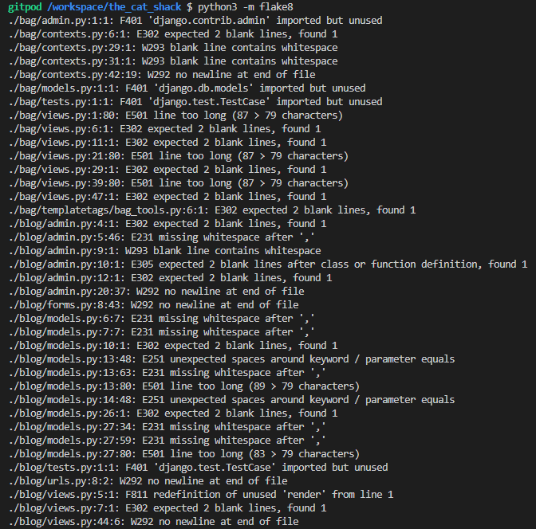
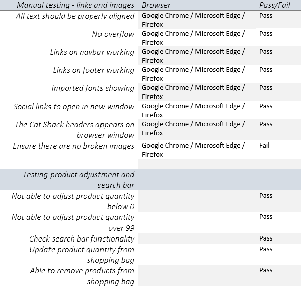

# Testing

- [Code Validators](#Code-Validators)
- [Testing User Stories](#Testing-User-Stories)
- [Manual Testing](#Manual-testing-log)
- [Error Handling](#Error-Handling)

## Code Validators

### W3C

W3C was used to test HTML. Errors were found relating to duplicate ID and missing alt tags on some
images. These were then fixed to ensure the pages were free of errors.

### Jigsaw

Jigsaw was used to ensure that CSS was properly validated. No errors were found.

### JS Hint
JS Hint was used to validate Javascript. There were a couple of errors regarding syntax and missing semi colons which were then fixed to ensure the code was error free. 

### PEP8 Online
The command python3 -m flake8 was used to find python errors.
 
 

These were by fixed by working through each app via the pep8 online website. Some errors remain such as in the migrations files as these are generated by django. 

## Testing User Stories

[Store Owner User Testing](https://github.com/rebeccadev/the_cat_shack/blob/main/readme_documentation/pdf/userstorystoreowner.pdf) - testing user stories for the store owner. 

[Shopper User Testing](https://github.com/rebeccadev/the_cat_shack/blob/main/readme_documentation/pdf/userstoryshopper.pdf) - testing user stories for shoppers. 

[Site User Testing](https://github.com/rebeccadev/the_cat_shack/blob/main/readme_documentation/pdf/userstorysiteuser.pdf) - testing user stories for the website user. 

[Logged In Site User Testing](https://github.com/rebeccadev/the_cat_shack/blob/main/readme_documentation/pdf/userstoryloggedinsiteuser.pdf) - testing user stories for the logged in website user. 

## Manual testing log

